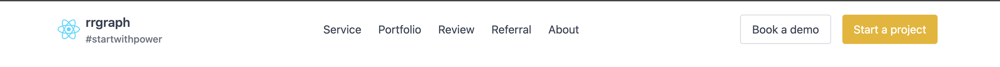
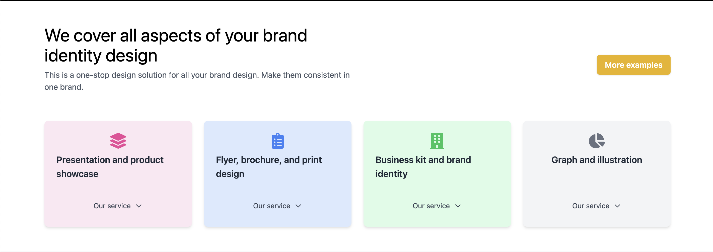
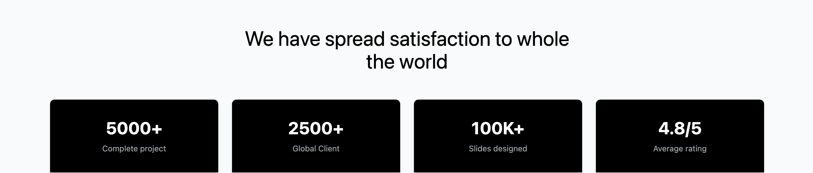
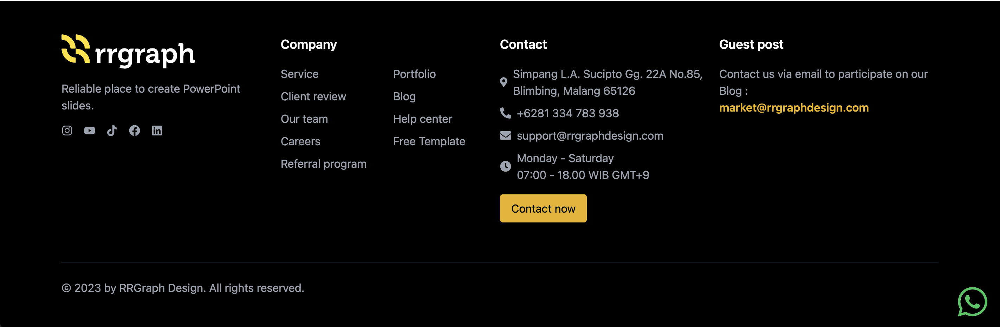

# React + Vite

This template provides a minimal setup to get React working in Vite with HMR and some ESLint rules.

Currently, two official plugins are available:

- [@vitejs/plugin-react](https://github.com/vitejs/vite-plugin-react/blob/main/packages/plugin-react/README.md) uses [Babel](https://babeljs.io/) for Fast Refresh
- [@vitejs/plugin-react-swc](https://github.com/vitejs/vite-plugin-react-swc) uses [SWC](https://swc.rs/) for Fast Refresh

## Components Overview

### 1. **Header Component**

Displays a responsive header with a logo and navigation links.

---

### 2. **LandPage Component**

Displays the landing page for the project.

---

### 3. **Partners Component**

Displays a grid of partner logos.

---

### 4. **Services Component**

Displays a grid of services.

---

### 5. **Achievements Component**

Displays a grid of achievements.

---

### 6. **Advantage Component**

Displays a grid of advantages.

---

### 7. **Footer Component**

Displays a responsive footer with copyright information.

## 

---

<!-- ## Project Walkthrough

Click the link to view the short video walkthrough showing all components in action.

--- -->

### Running the Code

Follow these steps to set up and run the project locally:

#### Step-by-Step Instructions

1. **Prerequisites**: Node.js (v14 or higher), npm (v6 or higher)
2. **Clone the Repository**: `git clone https://github.com/aminuaminaldo/rrgraph-clone.git`
3. **Install Dependencies**: `npm install`
4. **Run the Code**: `npm start`
5. **Verify the Output**: Open your web browser and navigate to `http://localhost:3000`. You should see the project's homepage.
